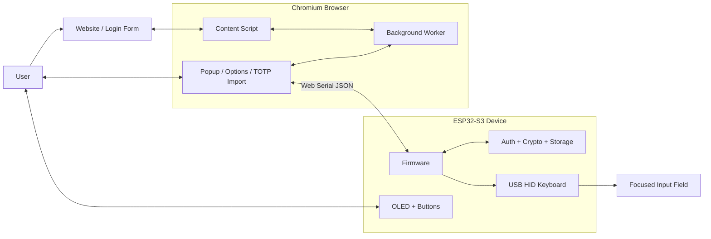

# Password Manager

This project is a hardware-assisted password manager built around an ESP32-S3 and a Chromium browser extension. The device stores encrypted credentials and optional 2FA/TOTP secrets, the extension manages them over Web Serial, and the device can type the selected login back into the host as a USB keyboard.

## Overview

The project has two main parts:

- `firmware/`: ESP32 firmware for storage, PIN-based unlock, TOTP generation, OLED UI, button input, USB serial, and USB HID typing
- `extension/`: Browser extension used to connect to the device, unlock it, manage credentials, capture passwords, and import TOTP secrets from QR codes

High-level flow:

1. The browser extension connects to the ESP32 over USB CDC/Web Serial.
2. You unlock the vault with a 4 to 8 digit PIN.
3. Credentials are added, listed, and managed through JSON commands over serial.
4. When you select a credential, the ESP32 types it through native USB HID.
5. If a saved account uses app-based 2FA, the device can also generate the current 6-digit TOTP token on demand.

## Architecture Diagram



The same USB connection is used for two different jobs:

- Web Serial for management commands such as unlock, list, add, delete, and TOTP requests
- USB HID keyboard output for typing the selected credential back into the active application

## Features

- Encrypted credential storage on the ESP32
- First successful unlock initializes the device PIN
- PIN-derived encryption key using PBKDF2-HMAC-SHA256
- AES-256-CBC encryption for stored credential records
- Auto-lock after inactivity
- Failed PIN attempt tracking with exponential lockout
- Up to 50 stored credentials
- 2FA support through encrypted TOTP secret storage and 6-digit token generation
- USB HID typing modes:
  - password only
  - username + `TAB` + password
  - username + `TAB` + password + `ENTER`
- TOTP secret storage and 6-digit TOTP generation
- Browser-side login capture from submitted forms
- Domain-aware autofill suggestions in password fields
- TOTP QR import from page images or pasted `otpauth://` URLs

## Repository Layout

```text
.
├── boards/                    Custom PlatformIO board definitions
├── extension/                 Chromium extension
│   ├── background.js          Notifications, context menus, message bridge
│   ├── content.js             Login capture + inline autofill suggestion UI
│   ├── popup.*                Main compact extension UI
│   ├── options.*              Full management/settings page
│   ├── serial.js              Web Serial transport
│   └── totp-qr.*              QR/TOTP import workflow
├── firmware/
│   ├── include/               Firmware headers
│   ├── src/                   Firmware sources
│   └── platformio.ini         Real PlatformIO configuration
└── platformio.ini             Repo-root wrapper for PlatformIO/VS Code
```

## Hardware

The default target is an ESP32-S3 development board with native USB, using the `esp32s3` PlatformIO environment.

Required peripherals in the current firmware:

- ESP32-S3 board with native USB HID/CDC support
- 128x64 I2C SSD1306 OLED display at address `0x3C`
- 2 momentary buttons
- USB connection to the host computer

### Pinout

| Function | GPIO |
| --- | --- |
| OLED SDA | `17` |
| OLED SCL | `18` |
| Next button | `5` |
| Confirm button | `4` |

Notes:

- Buttons are configured with `INPUT_PULLUP`, so each button should connect the GPIO to GND when pressed.
- The default board definition also assumes an ESP32-S3 N16R8-style setup with native USB enabled.

## Software Requirements

- [PlatformIO](https://platformio.org/) for building and flashing the firmware
- A Chromium-based browser with Web Serial support
  - Google Chrome
  - Microsoft Edge
  - other Chromium variants that expose `navigator.serial`

## Build and Flash the Firmware

The repository root already forwards PlatformIO to `firmware/platformio.ini`, so you can work from the top level.

Build:

```bash
pio run -e esp32s3
```

Flash:

```bash
pio run -e esp32s3 -t upload
```

Open the serial monitor:

```bash
pio device monitor -b 115200
```

Useful details:

- Default environment: `esp32s3`
- Framework: Arduino
- Monitor baud rate: `115200`
- USB HID typing is enabled for the active ESP32-S3 target

## Install the Browser Extension

1. Open `chrome://extensions/`
2. Enable Developer mode
3. Click `Load unpacked`
4. Select the `extension/` directory in this repository
5. Open the extension's Options page at least once and click `Connect`

Why open Options first:

- On some Chromium setups, port selection via `requestPort()` is more reliable from the full Options page than from the popup.
- Once the browser remembers the serial port, the popup can usually reconnect automatically.

## Usage

### 1. Connect and unlock

1. Plug in the ESP32-S3
2. Open the extension Options page or popup
3. Click `Connect`
4. Enter a numeric PIN

Behavior:

- If the device has never been initialized, the first successful unlock sets the PIN.
- Valid PIN length is 4 to 8 digits.
- On unlock, the extension also tries to sync the device clock for TOTP generation.

### 2. Add credentials

You can add credentials in a few ways:

- Manually from the extension
- By submitting a login form and saving the captured password from the extension notification
- By sending serial JSON commands directly from a custom host tool

Stored fields per credential:

- service
- url
- username
- password
- `totp_secret`
- HID typing mode flags

If an account uses authenticator-app 2FA, you can save its TOTP secret together with the login so the current token can be generated later from the extension.

### 3. Select and type credentials

There are two ways to choose a credential:

- On-device: use the `Next` button to cycle through entries, then press `Confirm`
- From the extension: select a credential in the UI, then press the device `Confirm` button to type it

Typing modes:

- `0`: password only
- `1`: username + `TAB` + password
- `2`: username + `TAB` + password + `ENTER`

### 4. Autofill workflow

When the extension sees a saved domain on a page with a password field, it injects a small inline suggestion card.

Typical flow:

1. Open a page with a login form
2. Click the injected autofill suggestion
3. The extension opens filtered to matching credentials
4. Choose the saved login
5. Press `Confirm` on the device to type it

The extension also listens for submitted login forms and can prompt you to save newly entered credentials.

### 5. 2FA / TOTP workflow

TOTP secrets can be attached to a credential so the device can generate the current 6-digit 2FA token when you need it.

Supported methods:

- Enter a Base32 secret manually
- Paste an `otpauth://totp/...` URL
- Right-click a QR image on a web page and choose `Save QR as TOTP secret…`

Typical 2FA flow:

1. Save the login as usual
2. Attach the site's TOTP secret to that same credential
3. Unlock the device from the extension
4. Open the TOTP view for that credential
5. Read the current 6-digit token and use it in the site's 2FA prompt before it expires

How it works:

- The TOTP secret is stored encrypted on the device along with the credential.
- The 6-digit token is generated on demand by the device.
- Tokens refresh every 30 seconds.

Important:

- The device must have a correct clock for TOTP to work.
- The extension syncs time after unlock, but the device does not currently fetch time on its own.

## Storage and Security Model

What is currently implemented:

- Credential records are encrypted before being written to NVS/Preferences on the ESP32.
- The encryption key is derived from the PIN using PBKDF2-HMAC-SHA256 with `10000` iterations.
- The firmware uses a per-record random IV and AES-CBC encryption.
- A verifier block is stored so the firmware can check whether a PIN-derived key is correct.
- Failed unlock attempts are counted, and after 5 wrong PINs the device enters timed lockout with exponential backoff.
- The firmware auto-locks after 120 seconds of inactivity.

What this means in practice:

- Secrets are protected at rest on the device.
- The host browser still handles plaintext credentials when you add or save them.
- Serial communication is intended for a trusted, locally connected host.

Current storage limits:

- Maximum credentials: `50`

## Serial Protocol

The firmware speaks line-delimited JSON over USB serial at `115200` baud.

Request example:

```json
{"cmd":"unlock","pin":"1234"}
```

Successful response:

```json
{"status":"ok","token":"..."}
```

Error response:

```json
{"status":"error","message":"wrong_pin"}
```

Implemented commands:

| Command | Purpose |
| --- | --- |
| `ping` | Health check |
| `unlock` | Unlock or initialize the PIN on first use |
| `lock` | Lock the vault |
| `sync_time` | Set device UNIX time for TOTP |
| `list` | List stored credentials without exposing passwords |
| `select` | Set the active credential on the device |
| `add` | Add one credential |
| `delete` | Delete one credential |
| `get_totp` | Generate the current TOTP code for a credential |
| `update_totp` | Add, replace, or remove a TOTP secret |
| `import` | Bulk import credentials from a JSON array |
| `change_pin` | Re-encrypt all credentials under a new PIN-derived key |

Notes:

- `list` returns metadata such as service, URL, username, and TOTP presence, not the stored password.
- `change_pin` and `import` exist in the firmware protocol, but the current extension UI does not expose them yet.

## Current Limitations

- Chromium/Web Serial is required for the browser integration.
- The extension's `Auto-lock` setting only controls popup-side locking behavior; the device firmware still has its own fixed 120-second inactivity lock.
- The firmware UI renderer contains a TOTP display state, but the current two-button flow does not switch into it.
- There are no automated tests in the repository yet.

## Development Notes

- Open the repo root in VS Code if you want PlatformIO to pick up the wrapper `platformio.ini`.
- The active firmware target is `esp32s3`; there are commented legacy targets for other ESP32 boards in `firmware/platformio.ini`.
- The current codebase still contains placeholder UI strings such as `Passwords` in the extension and `VaultKey` in the firmware display, but this README intentionally stays unbranded.
